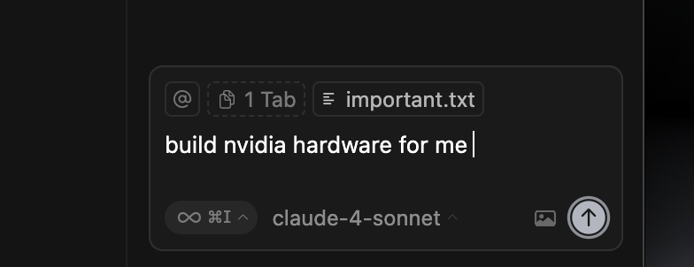

# How to Use the Cursor Stopper - Simple Guide 🚀

*A super easy guide for anyone to use this tool!*

## What Does This Do? 🤔

This is like a **magic button** that can close the Cursor app (a code editor) automatically when you tell it to. Think of it like a remote control for your computer!

## What You Need 📋

1. A computer (Mac, Windows, or Linux)
2. The Cursor app installed on your computer
3. This special folder with the magic files
4. **IMPORTANT:** You need to create a file called `important.txt` 📄

## Step-by-Step Instructions 👣

### Step 1: Create the Important File First! 📄

**SUPER IMPORTANT:** Before anything else, you need to make a special file!

1. Go to the folder where all the magic files are
2. Right-click in an empty space
3. Choose "New File" or "Create New" → "Text File"
4. Name it exactly: `important.txt`
5. Open the file and write anything you want inside (like "Hello!" or "My important file")
6. Save the file

**🏷️ EXTRA IMPORTANT - Don't Forget This!**
When you're working with Cursor and want to use this magic tool, **always remember to tag the `@important.txt` file in your prompts!** 

**Example:** When typing in Cursor, write something like:
```
@important.txt Help me with my code
```

**Here's what it looks like in Cursor:**



**Why tag it?** This tells Cursor to look at your important.txt file, which helps the magic system work better! 🎯

**Why do you need this file?** The magic program looks for this file to work properly. Without it, the magic won't start! 🎯

### Step 2: Open Your Terminal 💻

**What's a terminal?** It's like a special text window where you can talk to your computer.

**How to open it:**
- **Mac**: Press `Cmd + Space`, type "Terminal", press Enter
- **Windows**: Press `Windows key + R`, type "cmd", press Enter
- **Linux**: Press `Ctrl + Alt + T`

### Step 2: Go to the Magic Folder 📁

1. In the terminal, you need to "walk" to the folder with our magic files
2. Type this and press Enter:
   ```
   cd /path/to/cursorhack
   ```
   *(Ask an adult to help you find the right path)*

### Step 3: Start the Magic! ✨

1. Type this command and press Enter:
   ```
   node server.js
   ```

2. You should see something like:
   ```
   🚀 Server running on http://localhost:3006
   📂 Completed file path: /path/to/completed.json
   ```

**Congratulations!** The magic is now running! 🎉

### Step 4: How to Stop Cursor 🛑

Now you have a special file called `completed.json`. Think of it like a **magic switch**!

**To stop Cursor:**

1. Open the file called `completed.json` (you can double-click it)
2. Look for this part:
   ```
   "completed": false
   ```
3. Change `false` to `true`:
   ```
   "completed": true
   ```
4. Save the file (Ctrl+S or Cmd+S)

**BOOM!** 💥 Cursor will close automatically!

## What Happens? 🎭

1. **You change the file** → The magic detects it
2. **Magic finds Cursor** → It looks for the Cursor app running
3. **Magic closes Cursor** → It tells Cursor to close immediately
4. **File resets** → The magic changes it back to `false` automatically

## Easy Controls 🎮

While the magic is running, you can press these keys:

- **Press `q`** → Stops the magic program
- **Press `Ctrl+C`** → Also stops the magic program

## Example: Let's Do It Together! 👥

**Imagine you're doing homework and want to close Cursor when you're done:**

1. ✅ Start the magic (Step 3)
2. ✅ Do your work in Cursor
3. ✅ When finished, open `completed.json`
4. ✅ Change `"completed": false` to `"completed": true`
5. ✅ Save the file
6. ✅ Watch Cursor close by itself! 🎉

## Troubleshooting (When Things Don't Work) 🔧

**Problem: "The magic won't start!"**
- ❗ **Check if you made the `important.txt` file!** This is the most common problem
- Make sure the file is named exactly `important.txt` (not Important.txt or important.TXT)
- The file should be in the same folder as all the other magic files
- 🏷️ **Don't forget to tag `@important.txt` in your Cursor prompts!** This is super important!

**Problem: "Nothing happens when I change the file"**
- Make sure you saved the file after changing it
- Check that Cursor is actually running
- Ask an adult to help check if the magic is still running

**Problem: "I can't find the completed.json file"**
- Look in the same folder as the other magic files
- If it's not there, try starting the magic again (Step 4)

**Problem: "The terminal shows scary red text"**
- Don't worry! Red text just means something needs fixing
- Ask an adult to help
- You can always close the terminal and try again

## Safety Tips! ⚠️

1. **Always save your work first!** The magic closes Cursor immediately, so save anything important
2. **Ask for help** if you see error messages
3. **Don't change other files** - only change the `completed.json` file
4. **It's okay to make mistakes** - you can always start over!

## Fun Facts! 🌟

- The magic can find Cursor even if you have many programs open
- It works like a robot that follows your instructions
- You can use this as many times as you want
- It's like having a super power to control your computer!

## Need Help? 🆘

If something doesn't work:
1. Try closing everything and starting over
2. Ask an adult, teacher, or older sibling for help
3. Make sure all the files are in the right place
4. Check that you typed everything correctly

---

**Remember:** You're learning to control your computer like a pro! Even adults sometimes need help with these things, so don't worry if it takes a few tries to get it right. 🌟

**Have fun and happy computing!** 🎈
